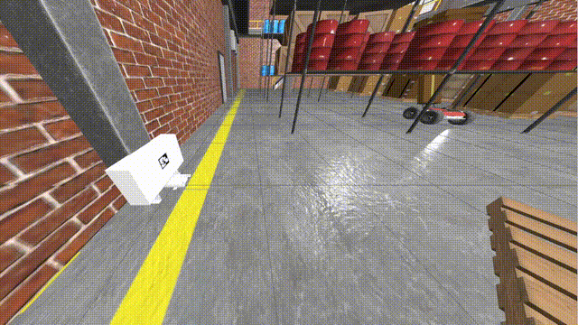

# Docking Robot

🔋 A simulated example of [Open Navigation's Nav2 Docking Framework](https://github.com/open-navigation/opennav_docking) in the wild!
This project makes use of the Husarion's simulated Panther robot that was placed in a warehouse-like Gazebo environment.
The robot's objective is to safely approach and connect to a charging station marked with an AprilTag.



## Prerequisites

- 🐋 [Docker Compose](https://docs.docker.com/compose)

## Getting Started

Just go ahead and run these few commands in your terminal:
```sh
$ git clone https://github.com/rayferric/docking_robot.git
$ cd docking_robot
$ docker-compose up
```

Once the image is built and the container boots up, you should see two windows pop up on your desktop - Gazebo and RViz.

> [!IMPORTANT]
> When running the container, if none of the windows show up and you happen to see this error message:
> > Authorization required, but no authorization protocol specified
>
> ...it indicates that your Docker group does not have access to the X server
> and thus you cannot run GUI applications inside containers.
> In order to fix it, you may need to run the following command:
> ```sh
> $ xhost +local:docker
> ```

Then you can use the "2D Goal Pose" tool in RViz to make the Panther navigate to any location on the map.

To initiate the docking sequence, attach a terminal to the container and use the `DockRobot` action:
```sh
$ docker exec -it docking_robot-docking_robot-1 bash
$ source /ws/install/setup.bash
$ ros2 action send_goal /dock_robot opennav_docking_msgs/action/DockRobot "{dock_id: home_dock}"
```

The robot should start making its way to the charging station and, in the end, attach to it.

Undock with:    
```sh
$ ros2 action send_goal /undock_robot opennav_docking_msgs/action/UndockRobot "{dock_type: simple_charging_dock}"
```

> [!NOTE]
> If the performance of the simulation is low, running with a discrete GPU might help.
> For AMD devices, you can use the `compose.amdgpu.yaml` configuration:
> ```sh
> $ docker-compose -f compose.amdgpu.yaml up
> ```

## About

### Tech Stack

- 🐢 ROS 2
- 🛖 Gazebo Fortress
- 🧭 Nav2
- 🐳 Docker

### Authors

- Ray Ferric ([rayferric](https://github.com/rayferric))

### License

You are free to reuse any part of my code in this repository without any restrictions. However most of the resources used by my project (particularly the Panther robot by Husarion) have their own respective licenses, so please refer to them before using them in your own projects.
